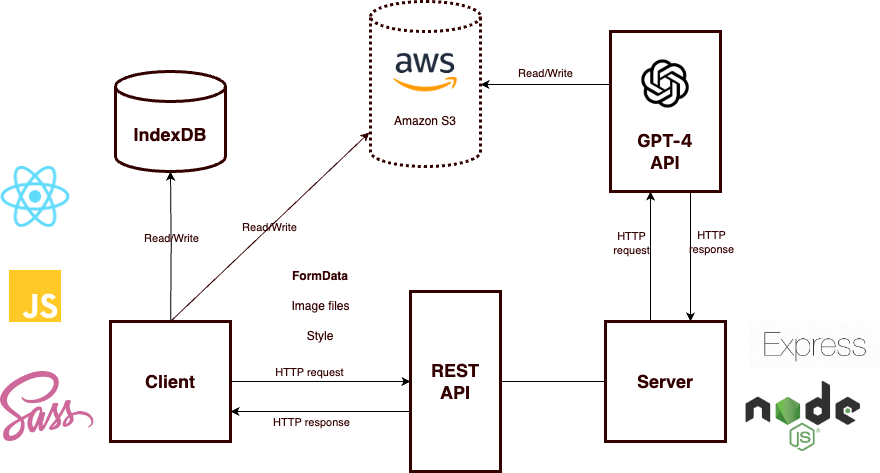
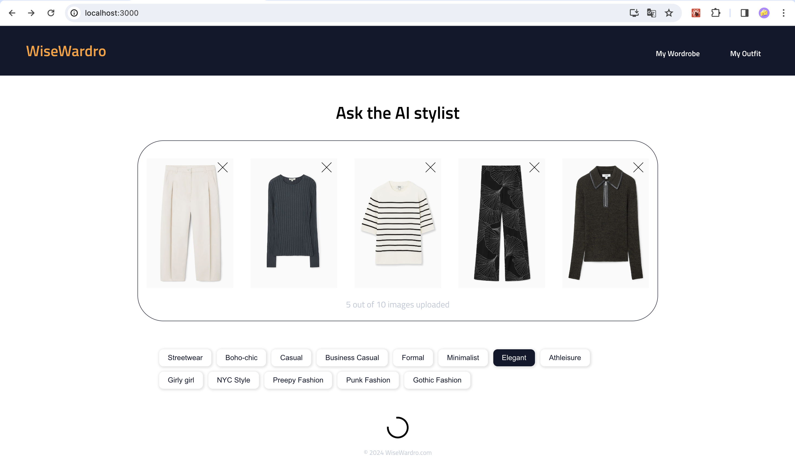
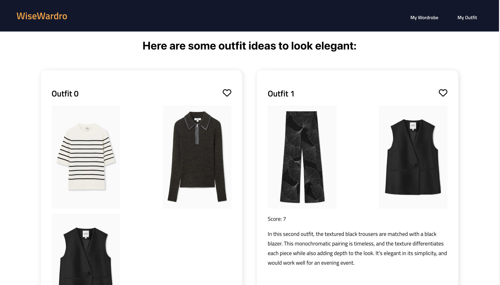
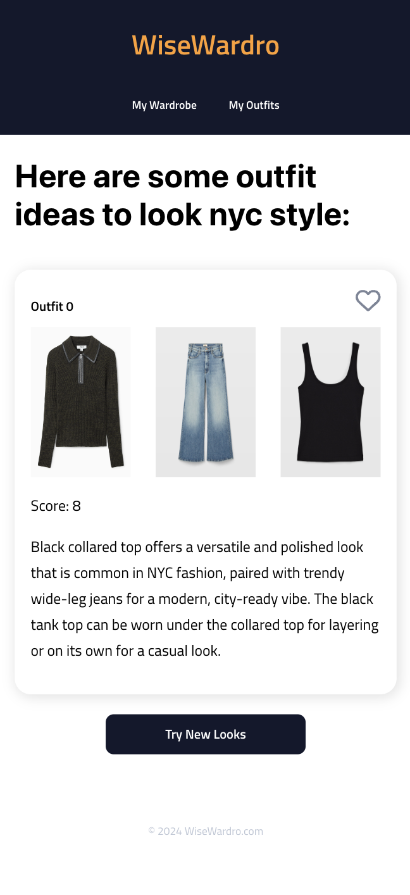
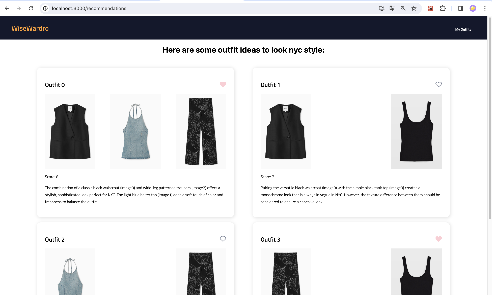
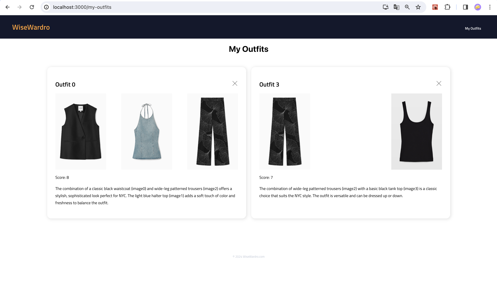

# WiseWardro

Have you ever stared at your closets, unsure of what to wear or if your outfit even matches your style? And what about mixing old favorites with new additions? It's a puzzle! But fear not, because that's where WiseWardro comes in! Checkout this video below that shows how simple it is to use WiseWardro.

[](https://www.youtube.com/watch?v=pKMiv-bPQ00)

WiseWardro is an AI fashion advisor powered by the GPT-4 Vision model. Whether you need a second opinion on that new jacket, want to mix and match your favorite jeans with a funky top, or just need some inspiration for your next outfit, WiseWardro has got your back. I will show you how to use WiseWardro in this video.

Imagine having your own personal fashion guru right at your fingertips. With WiseWardor, you can get expert advice on outfit combinations that suit your unique style preferences.

So, whether you need a second opinion on that new jacket, want to mix and match your favorite jeans with a funky top, or just need some inspiration for your next outfit, WiseWardro has got your back.

Just drag and drop your clothing images, choose your style vibe, hit 'Ask Advisor,' and voilà! Our AI-powered fashion genie works its magic and presents you with a gallery of outfit suggestions that are spot-on for you.

You can even save your favorite looks for later and easily access them whenever you need a fashion boost.

Say goodbye to outfit dilemmas and hello to effortless style with WiseWardro. Let's dive in and see how it works!

## Tech stack

- The project used **React.js, JavaScript, CSS, SASS** for the front-end development.
- For data persistence, we used **IndexDB** to store images and outfit combinations in the client side.
- The server and RESTful api was designed with **Node.js with Express.js**.
- The main feature of outfit suggestion was powpered by openAI gpt4 vision API.



## Features and/or usage instructions

1. Uploads images with drags and drop, and selected styles before consuliting outfit ideas
   

2. Get outfit inspirations
   <div style="display: flex; justify-content: space-between">
     
     
   </div>
3. Save an outfit as favorites
   

4. check all saved outfits
   

## Installation

1. Clone the project repository:

   ```bash
   git clone [https://github.com/Zijing-Liu/InStock-finch-client.git]
   ```

2. Install all dependencies in both client directory and server directory

   ```bash
   npm install
   ```

3. Start the client

   ```bash
   npm start
   ```

4. Start the server:
   ```bash
   node index.js
   ```

## API references

**POST** (api/clothes): send a list of image files in the payload, get the resopnse from openAI open with messages of oufit advice.

External API reference[openai](https://platform.openai.com/docs/guides/vision)

## Lessons learned & next steps

- In order to get more accurate result, the prompt needs to be further refined.
- Currently the app uses IndexDB for client-side image storage, and images are communicate as form data between the client and server. Will implement cloud data storage for scaling purposes.
- Implement user profile feature, so we an get more specifics of each individual user, using this data to query gpt vision model, therefore to get more personalized fashion suggestions target to the user.
