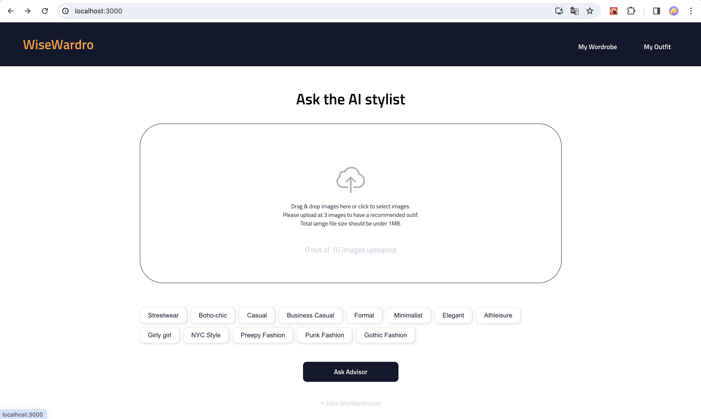

# WiseWardro



## Tech stack

- The project used **React.js, JavaScript, CSS, SASS** for the front-end development.
- For data persistence, we used **IndexDB** to store images and outfit combinations in the client side.
- The server and RESTful api was designed with **Node.js with Express.js**.
- The main feature of outfit suggestion was powpered by openAI gpt4 vision API.

## Features and/or usage instructions

1. Uploads images with drags and drop, and selected styles before consuliting outfit ideas
   

2. Get outfit inspirations
   

## Installation

1. Clone the project repository:

   ```bash
   git clone [https://github.com/Zijing-Liu/InStock-finch-client.git]
   ```

2. Install all dependencies in both client directory and server directory

   ```bash
   npm install
   ```

3. Start the client

   ```bash
   npm start
   ```

4. Start the server:
   ```bash
   node index.js
   ```

## API references

**POST** (api/clothes): send a list of image files in the payload, get the resopnse from openAI open with messages of oufit advice.

External API reference[openai](https://platform.openai.com/docs/guides/vision)

## Lessons learned & next steps

- In order to get more accurated result, the prompt needs to be further refined.
- Currently the app uses IndexDB for client-side image storage, and images are comminicated as formdata between the client and server. Will explore data clould
